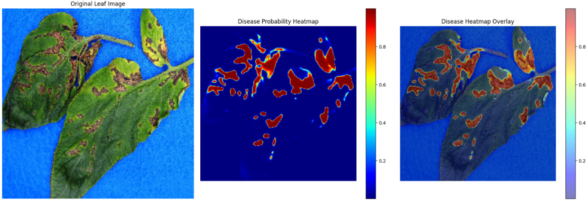

🌿 Plant Disease Lesion Segmentation and Severity Estimation using U-Net
📌 Overview

This project presents a deep learning–based framework for automatic plant disease lesion segmentation and disease severity estimation using a custom U-Net architecture implemented in PyTorch. The model was trained on approximately 3,528 annotated plant leaf images with corresponding lesion masks to accurately identify diseased regions and estimate infection severity.

The framework helps automate plant disease analysis for smart agriculture and precision farming applications by reducing manual inspection efforts and improving disease monitoring efficiency.

🚀 Key Features
🌱 Automatic plant disease lesion segmentation
📊 Disease severity estimation
🧠 Custom U-Net architecture using PyTorch
🔄 Advanced data augmentation techniques
🎯 Accurate segmentation of irregular lesion regions
🔥 Heatmap and mask visualization
📈 Strong model generalization and performance
🧠 Methodology

The proposed system follows a complete deep learning pipeline for semantic segmentation:

Dataset Preprocessing
Image resizing and normalization
Mask preparation
Data Augmentation
Horizontal & vertical flipping
Rotation
Brightness adjustment
Scaling and transformations
Model Training
Custom U-Net architecture
PyTorch implementation
Loss Function
Tversky Loss
Binary Cross Entropy (BCE) Loss
Prediction & Severity Estimation
Lesion mask prediction
Infected area calculation
Disease severity percentage estimation
📊 Results

The trained model achieved strong segmentation performance with:

Accurate lesion boundary detection
Reliable disease severity estimation
Better segmentation of small and irregular disease spots
Improved visualization using predicted masks and heatmaps

The project demonstrates the effectiveness of deep learning techniques for automated plant disease monitoring and precision agriculture applications.

🛠️ Technologies Used
Python
PyTorch
OpenCV
NumPy
Matplotlib
Albumentations

🖼️ Output Visualizations

📥 Dataset

Due to GitHub file size limitations, the dataset is provided separately.

🌱 Applications
Smart Agriculture
Precision Farming
Crop Disease Monitoring
AI-Based Agricultural Systems
Automated Plant Health Analysis
🔮 Future Scope
Multi-class disease segmentation
Transformer-based segmentation architectures
Real-time mobile deployment
IoT-based smart farming integration
Cloud dashboard for agricultural analytics

📌 Conclusion

This project successfully demonstrates a deep learning–based approach for automated plant disease lesion segmentation and disease severity estimation using U-Net architecture. The framework provides accurate segmentation results and can serve as a scalable AI solution for intelligent agricultural monitoring and precision farming systems.
